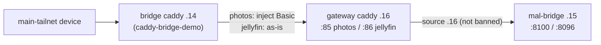

# sharedscale

## What sharedscale is

`sharedscale` is a [Headscale](https://headscale.net/) coordination server hosted on hetzner at `https://sharedscale.mtib.dev` (control plane on `:443`). It is a *separate tailnet* from anyone's "main" tailnet — multiple users (currently `mtib` and `mal`) join it so they can share services with each other without putting those services on the open internet.

Two roles a host can play:

1. **Service host** — runs a container app plus a `tailscale/tailscale` sidecar that joins sharedscale and exposes the app's ports on a sharedscale IP (`100.104.4.x`).
2. **Bridge host** — runs two tailscale containers and a caddy reverse proxy so that requests from a *main* tailnet reach services *inside* sharedscale without every device on the main tailnet having to join sharedscale directly.

The local source of truth for what lives in sharedscale and how to administer it is `/Users/mtib/Code/sharedscale/` (cloned from the sharedscale repo). The service inventory is `services.yml`.

The headscale extra-records DNS file for mtib's *main* tailnet is `/Users/mtib/Code/infrastructure/headscale/extra-records.json` (cloned from `mm-tasty/infrastructure`).

## When to use

- Exposing a service from any host (NAS, hetzner, a partner's machine, a dev laptop) into sharedscale so the other sharedscale user can reach it.
- Standing up a new bridge on a host that's in a main tailnet (mtib's headscale or partner's official tailscale) so devices on that main tailnet can reach sharedscale-only services.
- Approving routes, deleting stale nodes, or otherwise administering sharedscale via the remote CLI.
- Updating `services.yml` after adding/removing/changing a service.

**Don't use** for services that should live entirely in mtib's headscale tailnet (`*.vpn.mm`) — use `deploying-to-mtib-nas` for those. Sharedscale is specifically for things shared across users' tailnets.

## Live topology (read this first when something is "403" or unreachable)

Nodes (sharedscale, `100.104.4.0/24`):

| IP | Node | Role |
|---|---|---|
| `.14` | `mtib-headscale-to-sharedscale` | The bridge: carries mtib's main tailnet (headscale) into sharedscale. NAS containers `ts-bridge-ts-shared-1` + `caddy-bridge-demo`. Main-tailnet side is `100.104.3.19`. |
| `.15` | `mal-bridge` | **mal's** Caddy. Fronts mal's services (jellyfin `:8096`, photos `:8100`, ...). **Runs CrowdSec** — it bans source IPs (see "Diagnosing a 403"). |
| `.16` | `mtib-sharedscale-gateway` | mtib's Caddy gateway on the NAS. Both the **inbound** door for mal into mtib's stuff and the **allowed egress** towards mal's services. |
| `.18` | audiobookshelf | Direct sidecar. |
| `.20` | `mtib-startpage-relay` | Hetzner relay pair for the startpage status probes. |

### Direction matters: the gateway is also the way OUT to mal

The gateway has two jobs. Don't mix them up:

- **Inbound (mal → mtib)**: gateway `:83` copyparty/PocketBase (injects `Tailscale-User: mal`), `:84` TurboFieldfare via the ai-relay. mal dials `100.104.4.16:<port>`.
- **Outbound (mtib → mal)**: gateway `:85` photos, `:86` jellyfin. These exist because **mal-bridge's CrowdSec banned the bridge source `.14`** (scenario `crowdsecurity/http-generic-bf`, found 2026-10-05; jellyfin streamed fine through `.14` until ~2026-10-01). A banned source gets an **empty-body 403 from Caddy** regardless of credentials, Host header or path. It is a *ban*, not a hand-kept allowlist: `.16` and `.20` were never banned. (We first misread it as an allowlist — a wrong theory that survived several tests because identical requests from `.14` and `.16` really did differ.)

So: **point the bridge (`.14`) at the gateway's outbound port instead of straight at `100.104.4.15`**, and let the gateway dial `.15`. That is the workaround while `.14` stays banned, and it keeps working if it is cleared. To use `.14` directly again, mal must clear the decision and ideally whitelist the sharedscale bridge/gateway/relay sources in CrowdSec so repeated 401s from our proxies can't re-ban them:



Current routes on the NAS (`~/containers/ts-bridge/caddy/Caddyfile` = bridge, `~/containers/sharedscale-gateway/Caddyfile` = gateway):

| Hostname (main tailnet → `100.104.3.19`) | Bridge forwards to | Gateway forwards to |
|---|---|---|
| `jellyfin.mal.vpn.shared` | `100.104.4.16:86` | `100.104.4.15:8096` |
| `photos.mal.vpn.shared` | `100.104.4.16:85` + injected `Authorization: Basic` | `100.104.4.15:8100` |
| `copyparty.vpn.shared`, `cc.mal.ts` | `100.104.4.16:83` | local copyparty |

**Credential injection**: photos is behind HTTP Basic (realm `restricted`, user `boo`). The *bridge* block sets `header_up Authorization "Basic <b64>"`, so any VPN member gets in with no prompt (and a client-supplied login is overridden). The *gateway* `:85` block deliberately does NOT inject, so hitting `100.104.4.16:85` directly still gives 401. The password lives only in that bridge Caddyfile (NAS, world-writable, base64) — never in `services.yml`, git, or a skill. Ask mal for it if it must be re-created.

**Diagnosing a 403 from a sharedscale service** — first ask "which source IP am I?":

1. Empty body (`Server: Caddy`, `Content-Length: 0`), same 403 with the right credentials, a wrong password, another path, another Host → the source IP is banned (mal's CrowdSec) or otherwise filtered by IP. Not an auth problem. Prove it: send byte-identical requests from two netns (`docker exec containers-sharedscale-gateway-1 ...` vs `docker exec caddy-bridge-demo ...`, use `curl` or `nc`). Different answers for identical bytes = origin-based. Check the local side is sane first (netns target, `ip route get`, source IP on `tailscale0`, `tailscale ping`), then **ask mal for `cscli decisions list` / her Caddy + CrowdSec logs** — we cannot see her side.
   **Candidate causes for "works from `.16`, fails from `.14`" — rule them out in this order** (the 2026-10-05 incident was #1, but #2 was the first suspect and looks identical from the outside until you check):

   | # | Cause | Symptom | How to tell |
   |---|---|---|---|
   | 1 | **CrowdSec (or similar) ban on the source IP** on mal's side, e.g. `crowdsecurity/http-generic-bf` after repeated 401s | Fast, empty-body `403` + `Server: Caddy`; other sources fine; identical bytes from two netns differ | Only mal can confirm: `cscli decisions list`, her Caddy/CrowdSec logs. Fix: `cscli decisions delete --ip <ip>` + whitelist our sharedscale sources |
   | 2 | **Orphaned netns after a container recreate** — a joiner (`network_mode: container:<id>`/`service:<x>`) still runs but is attached to a destroyed namespace of the container it was joined to | Timeouts / connection refused / node `offline` in `sharedscale nodes list`; **never** an HTTP 403 from the far end | `~/netns-audit.sh` (`ORPHANED`), `docker inspect -f '{{.HostConfig.NetworkMode}}'` vs the target's current ID, `ip route get <ip>` + `curl -w %{local_ip}` from inside the joiner, `tailscale ping`. Fix: recreate the **joiner** |
   | 3 | Source-IP allowlist on the far side's Caddy (`remote_ip`) | Same empty `403` as #1 | Indistinguishable from #1 without her config; ask her. Not the cause on 2026-10-05, but possible in general |
   | 4 | Wrong source IP seen by the far side (userspace-mode tailscale proxying via `127.0.0.1`, or a MASQUERADE rewrite) | Allowed/banned decisions look random | `TS_USERSPACE=false`; check `iptables -t nat -S` in the netns |

   If the far end returned an HTTP response at all, the network path and netns are working — suspect #1/#3, not #2.
2. A `401` with `WWW-Authenticate: Basic realm="restricted"` → you got past the IP filter; you just need credentials.
   - Don't hammer it with wrong credentials while testing: repeated 401s are exactly what `http-generic-bf` bans.
3. BusyBox `wget` can't show error bodies (`--content-on-error` is missing) — use `curl` or `nc` inside the containers.

**Adding a new mal service reachable from mtib's side** (checklist):

1. Gateway Caddyfile: append a `:8N { reverse_proxy 100.104.4.15:<port> }` block (next free port after `:86`), then `docker exec containers-sharedscale-gateway-1 caddy reload --config /etc/caddy/Caddyfile`.
2. Bridge Caddyfile: add `<name>.mal.vpn.shared:80 { reverse_proxy 100.104.4.16:8N }` (plus `header_up Authorization` if the upstream wants Basic and everybody should get in), reload `caddy-bridge-demo`.
3. DNS: add `<name>.mal.vpn.shared → 100.104.3.19` in `extra-records.json` **through a PR** (see "DNS records" below).
4. `services.yml` entry in the sharedscale repo (via PR, no secrets).
5. `~/netns-audit.sh` on the NAS if anything was *recreated* rather than reloaded.

**Edit both NAS Caddyfiles in place.** They are single-file bind mounts: `sed -i` (or any write-new-then-rename) swaps the inode and the container keeps the old content. Use `cat > file`, `tee`, or `>>`, take a `cp` backup first, and run `caddy validate` before `caddy reload`.

## Prerequisites (one-time, per admin machine)

1. Obtain a sharedscale API key (ask mtib; rotate via `sharedscale apikeys create -e 90d` from an already-authed admin shell).
2. Download the matching `headscale` binary from the [headscale releases](https://github.com/juanfont/headscale/releases) and put it on `$PATH`.
3. Create a `sharedscale` wrapper somewhere on `$PATH`:

   ```sh
   #!/usr/bin/env bash
   export HEADSCALE_CLI_ADDRESS="sharedscale.mtib.dev:443"
   export HEADSCALE_CLI_API_KEY="<api-key>"
   exec headscale "$@"
   ```

   `chmod +x` it. Now `sharedscale nodes list`, `sharedscale users list`, etc. all hit the remote control plane via the [Remote CLI](https://headscale.net/stable/ref/remote-cli/) protocol.

4. (Bridge admin only) The wrapper for *your own* headscale, if you have one, is usually called `headscale` and points at *your* control plane — keep it distinct from `sharedscale`.

## Exposing a service to sharedscale (sidecar pattern)

Any docker host can publish a service into sharedscale by adding a tailscale sidecar that shares the network namespace of the service container. The sidecar gets a `100.104.4.x` address; the service's open ports are reachable on that address from inside sharedscale.

### 1. Add the sidecar to the service's compose file

```yaml
services:
  myapp:
    image: ...
    # NO `ports:` block needed for sharedscale exposure.
    # Add one only if you also need host-local access.

  ts-shared-myapp:
    image: tailscale/tailscale:latest
    restart: unless-stopped
    environment:
      - TS_STATE_DIR=/var/lib/tailscale
      - TS_EXTRA_ARGS=--login-server https://sharedscale.mtib.dev
    volumes:
      - ts-shared-myapp-state:/var/lib/tailscale
    devices:
      - /dev/net/tun:/dev/net/tun
    network_mode: "service:myapp"   # shares myapp's netns — exposes ALL its ports
    cap_add:
      - NET_ADMIN

volumes:
  ts-shared-myapp-state:
```

Key points:

- `network_mode: "service:myapp"` — the sidecar joins the app's network namespace so its sharedscale IP is the address on which the app's ports are reachable. Don't try to use a separate network.
- `TS_STATE_DIR` + a named volume — required so re-creating the container doesn't burn a new node every time.
- Name the sidecar `ts-shared-<app>` consistently so it's easy to spot when grepping compose files.
- **`TS_USERSPACE=false` if the fronted service needs the peer's real source IP.** The tailscale image defaults to userspace networking, which proxies inbound peer connections via localhost — so the fronted service sees `127.0.0.1` as the source instead of e.g. `100.104.4.x`. Kernel TUN mode (`TS_USERSPACE=false` + `cap_add: [NET_ADMIN]` + `/dev/net/tun` mounted) makes the fronted service see the real tailnet IP. Required when the upstream uses source IP for logging/audit/ACL — for example copyparty's upload log, which displayed `127.0.0.1` for every sharedscale upload until this was flipped on the `sharedscale-gateway-tailsacle` sidecar. Each TS sidecar's TUN device lives in its own netns (via `network_mode: service:`), so multiple TUN-mode sidecars on the same host don't conflict.

### 2. Start it and grab the register URL

```sh
docker compose up -d ts-shared-myapp
docker compose logs ts-shared-myapp | grep -E 'register/'
```

You'll see:

```
To authenticate, visit:
 https://sharedscale.mtib.dev:443/register/<key>
```

### 3. Register the node from an admin shell

Don't open the URL — register via the CLI so you control which sharedscale user owns the node (sharedscale users are coarse: `mtib`, `mal`, etc.):

```sh
sharedscale nodes register --key <key> --user mtib    # or `mal`
```

### 4. Find its sharedscale IP

```sh
docker compose exec ts-shared-myapp tailscale ip
```

You'll get a `100.104.4.x` address. That, plus the app's listening port, is how the service is reached from inside sharedscale.

### 5. Document it in services.yml

Edit `/Users/mtib/Code/sharedscale/services.yml` (matches `schema.json` in the same dir):

```yaml
- name: myapp
  owner: mtib
  ip: 100.104.4.X
  port: 8080
  description: short human description
  preferred_dns: myapp.vpn.shared   # optional — what bridges will route to it as
  certificate_base64: ...           # optional — only if myapp terminates its own TLS
```

Required: `name`, `owner`, `ip`, `port`. Commit + push to the sharedscale repo's main.

`certificate_base64` is the base64-encoded *armoured* PEM of the cert(s) the service terminates TLS with — only relevant if the service does its own TLS (e.g. caddy with `tls internal`). Most services don't and bridges terminate TLS for them. Encode with `cat path/to/fullchain.crt | base64` (single string, newlines fine).

## Alternative: one shared caddy gateway instead of per-service sidecars

The sidecar pattern is one-tailscale-container-per-service. That's clean isolation but noisy: ten exposed services = ten sidecars, ten state volumes, ten sharedscale nodes to administer. The alternative is a **single gateway**: one `tailscale` container joined to sharedscale, with one `caddy` sharing its netns, host-header-routing onto whatever upstreams the gateway can reach (local containers, host loopback, services in your *main* tailnet, …).

Use this when you have many small services on the same host (or admin domain) that all want to be reachable from sharedscale users.

### Compose layout

```yaml
services:
  ts-shared-gateway:
    image: tailscale/tailscale:latest
    restart: unless-stopped
    cap_add: [NET_ADMIN]
    devices:
      - /dev/net/tun:/dev/net/tun
    volumes:
      - ./.ts-shared-gateway-state:/var/lib/tailscale
    environment:
      - TS_USERSPACE=false
      - TS_STATE_DIR=/var/lib/tailscale
      # --accept-routes lets the gateway reach other tailnets' subnet-routed ranges
      # (e.g. another bridge advertising 10.x.x.x into sharedscale)
      - TS_EXTRA_ARGS=--accept-routes=true --login-server=https://sharedscale.mtib.dev

  caddy:
    image: caddy:latest
    restart: unless-stopped
    network_mode: "service:ts-shared-gateway"   # share netns: caddy listens on the sharedscale IP
    depends_on: [ts-shared-gateway]
    volumes:
      - ./caddy/Caddyfile:/etc/caddy/Caddyfile:ro
      - ./caddy/data:/data
      - ./caddy/config:/config
    # add `extra_hosts: ["host.docker.internal:host-gateway"]` if you need to dial host loopback
```

Register the gateway once (`sharedscale nodes register --key <key> --user mtib`), grab its sharedscale IP (`docker compose exec ts-shared-gateway tailscale ip`), and that single `100.104.4.x` becomes the address of every service the gateway fronts.

### Reaching upstreams from the gateway

Because caddy shares the `ts-shared-gateway` netns, it can dial:

- **Other containers on the same docker host** — by IP, or by name if you `external_links:` / attach them to a shared docker network. Easiest: put each upstream on its own user-defined network and add the gateway to all of them via `networks:` (one per upstream).
- **The host itself** — via `host.docker.internal:<port>` if you set `extra_hosts: ["host.docker.internal:host-gateway"]` on the *caddy* service (the netns inherits, but extra_hosts is per-service in compose; declare it on caddy).
- **Services in your main tailnet** — because `ts-shared-gateway` runs `--accept-routes=true`, anything it can also be joined to (or anything subnet-routed into sharedscale) is reachable by its tailnet IP. To dial a main-tailnet service directly, run a *second* tailscale container joined to the main tailnet and chain caddy → `ts-main` netns the same way the bridge does (see below) — or rely on a separately-running bridge in sharedscale that already exposes those main-tailnet services as routes.
- **Anything internet-reachable** — caddy just dials it.

### Caddyfile (host-header routing)

```caddyfile
# One TLS terminator on the gateway's sharedscale IP, fanning out by Host.
# Use `tls internal` so the gateway issues its own certs (consumers must trust
# the gateway's local CA, or accept the warning).

httpbin.vpn.shared {
  tls internal
  reverse_proxy httpbin:80         # docker DNS, same compose project
}

grafana.vpn.shared {
  tls internal
  reverse_proxy host.docker.internal:3000
}

myapp.vpn.shared {
  tls internal
  reverse_proxy 100.x.x.x:8080    # a service in your *main* tailnet, reachable via accept-routes
}

# Optional: catch-all on :80 for plain-HTTP smoke tests
:80 {
  respond "sharedscale gateway up" 200
}
```

The hostnames are arbitrary — they only need to resolve to the gateway's `100.104.4.x` on the consuming side. Add them to `services.yml` (as `preferred_dns`) and to whatever DNS your sharedscale users use to reach the gateway (see the bridge DNS sections below — the gateway is itself a sharedscale node, so any bridge that brings sharedscale into a main tailnet handles it too).

### When to pick this over sidecars

| Situation | Pick |
|---|---|
| One or two big services, want clean per-service Tailscale identity | Sidecar |
| Many small services on the same host, want one node to administer | Gateway |
| Service does its own TLS and ACLs in sharedscale should target its specific IP | Sidecar |
| Want to front host-loopback services (systemd units, things not in compose) | Gateway |
| Service is in a *main* tailnet and you want sharedscale users to reach it without exposing the host | Gateway with chained `ts-main` (mirrors the bridge layout in reverse) |

You can mix: have a gateway for the cluster of small services and dedicated sidecars for the one or two that warrant their own node.

### services.yml entries for gateway-fronted services

The `ip` is the gateway's sharedscale IP (same for every service it fronts); `port` is the gateway's listen port (`443` if you used `tls internal` per the Caddyfile above); `preferred_dns` is what users should use to reach it (the host header is what differentiates them):

```yaml
- name: httpbin
  owner: mtib
  ip: 100.104.4.X     # gateway IP — same as the next entry
  port: 443
  preferred_dns: httpbin.vpn.shared
  description: example httpbin, fronted by mtib-nas sharedscale gateway

- name: grafana
  owner: mtib
  ip: 100.104.4.X     # same gateway IP
  port: 443
  preferred_dns: grafana.vpn.shared
  description: grafana on nas host, fronted by mtib-nas sharedscale gateway
```

The `ip:port` duplication is intentional — `services.yml` documents reachability, not topology. A consumer that only knows the gateway IP can still reach both by sending the right Host header.

## Accessing sharedscale services from a "main" tailnet (the bridge)

A "bridge" host runs *two* tailscale containers in the same docker-compose:

- `ts-main` — joined to your main tailnet (mtib's headscale, OR official tailscale, OR any other tailnet).
- `ts-shared` — joined to sharedscale.

Plus a caddy that reverse-proxies onto sharedscale IPs. Devices on the main tailnet talk to the bridge; the bridge talks to sharedscale.

There are two routing techniques. Pick one per bridge; don't mix.

### Technique A — subnet-routing bridge (recommended default)

`ts-main` advertises a tiny private subnet (e.g. a /32 of a /24 that isn't used on either side) as a route in the main tailnet. Anything sent to that route gets routed to `ts-shared`+caddy, which proxies onward to sharedscale IPs.

Choose a subnet that doesn't collide with anything used on either tailnet — `10.5.5.0/24` is a fine default; only two addresses are actually used.

```yaml
services:
  ts-main:
    image: tailscale/tailscale:latest
    restart: unless-stopped
    cap_add: [NET_ADMIN]
    volumes:
      - ./.ts-main-state:/var/lib/tailscale
    devices:
      - /dev/net/tun:/dev/net/tun
    environment:
      - TS_STATE_DIR=/var/lib/tailscale
      # MAIN-TAILNET-SPECIFIC: omit --login-server for official tailscale,
      # set it to your headscale URL otherwise.
      - TS_EXTRA_ARGS=--advertise-routes=10.5.5.3/32 --login-server=<main-headscale-or-omit>
    networks:
      interconnect:
        ipv4_address: 10.5.5.2

  ts-shared:
    image: tailscale/tailscale:latest
    restart: unless-stopped
    cap_add: [NET_ADMIN]
    volumes:
      - ./.ts-shared-state:/var/lib/tailscale
    devices:
      - /dev/net/tun:/dev/net/tun
    environment:
      - TS_USERSPACE=false
      - TS_STATE_DIR=/var/lib/tailscale
      - TS_EXTRA_ARGS=--accept-routes=true --snat-subnet-routes=true --login-server=https://sharedscale.mtib.dev
    networks:
      interconnect:
        ipv4_address: 10.5.5.3

  caddy:
    image: caddy:latest
    container_name: caddy-bridge
    restart: unless-stopped
    network_mode: "service:ts-shared"   # caddy shares ts-shared's netns → it can see sharedscale IPs
    depends_on: [ts-shared]
    volumes:
      - ./caddy/Caddyfile:/etc/caddy/Caddyfile:ro
      - ./caddy/data:/data
      - ./caddy/config:/config

networks:
  interconnect:
    driver: bridge
    ipam:
      config:
        - subnet: 10.5.5.0/24
```

Bring up + register both tailscale containers (each prints its own register URL in logs; `ts-main` registers in your main tailnet, `ts-shared` in sharedscale):

```sh
docker compose up -d
docker compose logs ts-main   | grep register/   # → register with your main tailnet
docker compose logs ts-shared | grep register/   # → sharedscale nodes register --key ... --user mtib
```

Approve the advertised route in *both* coordination servers as needed. For mtib's headscale (main):

```sh
headscale nodes approve-routes -i "<ts-main node id>" -r "10.5.5.3/32"
```

For official tailscale, approve subnet routes in the admin console UI (Machines → ts-main → Edit route settings → enable `10.5.5.3/32`).

The route's destination IP (`10.5.5.3`) is the caddy host from a main-tailnet device's perspective: requests to `10.5.5.3:80` enter `ts-main`, get routed via the docker `interconnect` to `ts-shared`/caddy, then on into sharedscale.

### Technique B — TS_DEST_IP-routing bridge

Use this if you don't want to (or can't) advertise subnet routes — e.g. when administering the main tailnet's route approvals isn't practical. The tailscale container has a built-in forwarder: setting `TS_DEST_IP=X` rewrites *all* incoming traffic to that IP. So `ts-main` forwards everything that hits it onward to `ts-shared`+caddy.

The trade-off: each `ts-main` only forwards to one destination, so you typically have one bridge serving everything, with caddy doing host-header routing onward.

```yaml
services:
  ts-main:
    image: tailscale/tailscale:latest
    restart: unless-stopped
    cap_add: [NET_ADMIN]
    volumes:
      - ./.ts-main-state:/var/lib/tailscale
    devices:
      - /dev/net/tun:/dev/net/tun
    environment:
      - TS_USERSPACE=false
      - TS_STATE_DIR=/var/lib/tailscale
      - TS_DEST_IP=10.7.7.4
      - TS_SOCKET=/var/run/tailscale/tailscaled-main.sock
      - TS_EXTRA_ARGS=--login-server=<main-headscale-or-omit>
    networks:
      interconnect:
        ipv4_address: 10.7.7.2

  ts-shared:
    image: tailscale/tailscale:latest
    restart: unless-stopped
    cap_add: [NET_ADMIN]
    volumes:
      - ./.ts-shared-state:/var/lib/tailscale
    devices:
      - /dev/net/tun:/dev/net/tun
    environment:
      - TS_USERSPACE=false
      - TS_STATE_DIR=/var/lib/tailscale
      - TS_SOCKET=/var/run/tailscale/tailscaled-shared.sock
      - TS_EXTRA_ARGS=--accept-routes=true --snat-subnet-routes=true --login-server=https://sharedscale.mtib.dev
    networks:
      interconnect:
        ipv4_address: 10.7.7.4

  caddy:
    image: caddy:latest
    container_name: caddy-bridge
    restart: unless-stopped
    network_mode: "service:ts-shared"
    depends_on: [ts-shared]
    volumes:
      - ./caddy/Caddyfile:/etc/caddy/Caddyfile:ro
      - ./caddy/data:/data
      - ./caddy/config:/config

networks:
  interconnect:
    driver: bridge
    ipam:
      config:
        - subnet: 10.7.7.0/24
```

From a main-tailnet device, hitting `ts-main`'s main-tailnet IP (find via `docker compose exec ts-main tailscale ip`) gets forwarded to `ts-shared`/caddy, which proxies onward.

### Caddyfile on the bridge

`caddy` shares `ts-shared`'s netns, so it can dial sharedscale IPs (`100.104.4.x`) directly. Example serving the `httpbin` example service:

```caddyfile
:80 {
  reverse_proxy 100.104.4.3:80
}

# Optional: a friendlier name. Requires a DNS record on the *main* tailnet
# (e.g. headscale extra-records or the official tailscale MagicDNS split DNS)
# pointing example.vpn.shared → the bridge's reachable IP
# (10.5.5.3 for technique A, ts-main's tailnet IP for technique B).
example.vpn.shared {
  tls internal
  reverse_proxy 100.104.4.3:80
}
```

For mtib's headscale, add a DNS record (see "DNS records" below for the safe workflow — don't just edit the main checkout):

```json
{
  "name": "example.vpn.shared",
  "type": "A",
  "value": "10.5.5.3"
}
```

For official tailscale, use the Admin Console → DNS → Split DNS or Nameservers to add the same mapping (tailscale doesn't accept an `extra-records.json`).

**Regenerating the Caddyfile from `services.yml`** is the maintainable path once you have more than a couple of entries — the file lists every `preferred_dns` + `ip` + `port` for you. A small script that templates one `<dns> { reverse_proxy <ip>:<port> }` block per entry is enough; commit it alongside the bridge compose so the bridge config stays in sync with the source-of-truth services list.

If a service does its own TLS (`certificate_base64` populated), the bridge caddy should proxy with `reverse_proxy https://<ip>:<port>` and either `tls_trust_pool` the cert or `tls_insecure_skip_verify` (acceptable here because the bridge → service traffic is already inside sharedscale's WireGuard mesh).

### DNS records (headscale `extra-records.json`) — repo first, never the server

The live file is `/root/containers/headscale/var/extra-records.json` on hetzner (container `containers-headscale-1`, `extra_records_path: /var/lib/headscale/extra-records.json`). The **source of truth is the repo** `mm-tasty/infrastructure`, file `headscale/extra-records.json`. The GitHub Action `.github/workflows/deploy-headscale.yml` `scp`s that file over the live one on every push to `main` that touches it — so **a hand edit on hetzner is silently reverted by the next DNS deploy by anyone**. (This happened: on 2026-09-20 `start.vpn.mm` was added and `memos.vpn.mm` removed on the server only; the repo drifted and a later PR would have reverted both.)

Workflow:

1. **Diff live against the repo before editing**, and reconcile any drift into the repo first (live is usually right):
   ```sh
   ssh hetzner 'cat /root/containers/headscale/var/extra-records.json' > live.json
   git -C ~/Code/infrastructure fetch origin
   # compare by (name,type,value), not by whitespace:
   diff <(git -C ~/Code/infrastructure show origin/main:headscale/extra-records.json | jq -S 'map([.name,.type,.value])|sort') \
        <(jq -S 'map([.name,.type,.value])|sort' live.json)
   ```
2. Work in a worktree (`git worktree add -b feat/<slug> ~/Code/worktrees/infrastructure-feat-<slug> origin/main`), edit there, open a PR. **Merging the PR is what deploys** — leave that to the user.
3. Keep the file's 4-space JSON style, no duplicate names, and check `jq length`.
4. After the merge: `dig +short <name> @100.100.100.100` or just `curl` the new name from a main-tailnet device; confirm that unrelated records (`start.vpn.mm`, ...) are still present.

Don't use the "commit straight to `main`" habit from `~/Code/infrastructure` for this file, and never `scp` to hetzner directly. Other places that need the same warning: `deploying-to-mtib-nas` step 6, `deploying-to-hetzner`.

### Bridge maintenance

- **State volumes**: `.ts-main-state` and `.ts-shared-state` are the device identities. Don't delete them unless you mean to re-register. Back them up if the bridge is critical.
- **Re-registering**: if you blow away state, the next `docker compose up` prints a new register URL in logs. For `ts-main` follow your main tailnet's process; for `ts-shared` run `sharedscale nodes register --key <key> --user <user>`.
- **Re-approving routes** (technique A only): after re-registering `ts-main`, its node ID changes — re-run `headscale nodes approve-routes` (or re-tick the route in the tailscale admin UI).
- **Caddy reload after editing the Caddyfile**:
  `docker compose exec caddy caddy reload --config /etc/caddy/Caddyfile`
- **Updating images**: `docker compose pull && docker compose up -d`. Tailscale containers tolerate restarts; state persists in the volume.
- **Listing nodes**:
  - `sharedscale nodes list` — everything in sharedscale.
  - `sharedscale nodes list -o json | jq '.[] | {id, name, user: .user.name, ip: .ipAddresses}'` — compact view.
- **Removing a stale node**: `sharedscale nodes delete -i <id>`. Do this when a sidecar's state volume is gone.

## Administering sharedscale itself

The wrapper `sharedscale` runs any headscale CLI subcommand against the remote control plane:

```sh
sharedscale users   list
sharedscale nodes   list
sharedscale nodes   register --key <key> --user <user>
sharedscale nodes   approve-routes -i <id> -r <cidr>
sharedscale nodes   delete -i <id>
sharedscale apikeys list
sharedscale apikeys create -e 90d            # rotate; old key keeps working until expired
sharedscale apikeys expire -p <prefix>       # revoke an old key
```

Users (`mtib`, `mal`) are created with `sharedscale users create <name>`. Don't create one per service — a single user per *human* owner is the right granularity.

The sharedscale server itself lives on hetzner under `~/containers/` and is reloaded via the hetzner caddy patterns — see the `deploying-to-hetzner` skill if you need to touch the *server* (rarely needed; the data plane is what changes).

## Quick reference

| Item | Value |
|---|---|
| Control plane | `https://sharedscale.mtib.dev` (`:443`) |
| Tailnet IP range | `100.104.4.0/24` (`100.104.4.x` per node) |
| Service inventory | `/Users/mtib/Code/sharedscale/services.yml` |
| Schema | `/Users/mtib/Code/sharedscale/schema.json` |
| Admin CLI | `sharedscale <subcommand>` (wrapper around `headscale`) |
| Users | `mtib`, `mal` (per human, not per service) |
| Sidecar image | `tailscale/tailscale:latest` |
| Sidecar netns trick | `network_mode: "service:<app>"` |
| Bridge dir convention | `~/containers/sharedscale-bridge/` (or similar) |
| Bridge subnet (A) | `10.5.5.0/24` by default |
| Bridge subnet (B) | `10.7.7.0/24` by default |
| Bridge DNS suffix | `*.vpn.shared` (convention, optional) |
| Main-tailnet DNS (mtib) | `/Users/mtib/Code/infrastructure/headscale/extra-records.json` |
| Main-tailnet DNS (partner) | official tailscale admin UI (Split DNS) |

## Gotchas

- **`network_mode: "service:<app>"` is asymmetric**: the sidecar joins the app's netns, NOT the other way around. So `ports:` on the sidecar is ignored; declare ports (if any) on the app. The sidecar inherits whatever the app is listening on.
- **Don't open the register URL in a browser** — it associates the node with whatever sharedscale user is currently signed in, which is rarely what you want. Always `sharedscale nodes register --key ... --user ...`.
- **Userspace vs kernel networking**: a pure sidecar that doesn't need to forward subnets is fine in default userspace mode. Bridge containers (`ts-main`, `ts-shared`) need `TS_USERSPACE=false` because they're routing real packets. `/dev/net/tun` and `NET_ADMIN` are required for kernel mode.
- **Two tailscaled sockets on one host**: the bridge runs two tailscale daemons in two containers — set `TS_SOCKET` to distinct paths (`tailscaled-main.sock` / `tailscaled-shared.sock`) so they don't fight, even though they're in separate containers (the `tailscale` CLI inside each container needs the right socket).
- **Route approval is per-coordination-server**: technique A requires approving the advertised route on the *main* tailnet's control plane (not sharedscale). Forgetting this is the most common "bridge is up but I can't reach anything" failure.
- **`--snat-subnet-routes=true`** on `ts-shared` masquerades the source IP so sharedscale services see the bridge's sharedscale IP rather than a 10.x docker IP — keeps ACLs sensible on the sharedscale side.
- **State volume = node identity**: deleting `./.ts-shared-state` then `docker compose up` produces a *new* node in sharedscale (and the old one lingers until you `nodes delete` it). When iterating on compose, keep the volume unless you mean to start over.
- **Cert mismatch on `*.vpn.shared`**: bridge caddy uses `tls internal` → certs are signed by caddy's local CA on the bridge. Install that CA in browsers / OS trust stores on devices in the main tailnet, or accept the warning. (`infrastructure/keys/laptop.lab.caddy.crt` is an example of distributing such a CA.)
- **`docker compose logs ts-shared` after registration**: a successful join shows `Success.` and tailscale's regular peerlist log lines. Stuck at `To authenticate, visit:` means you haven't run `sharedscale nodes register --key ...` yet.
- **`services.yml` is documentation, not config**: nothing reads it automatically. Bridges template their Caddyfile from it manually (or via a small script). Keep it accurate — it's the only place future-you will look to remember what `100.104.4.7` is.

## Verifying

For a new sidecar:
1. `docker compose ps` shows `ts-shared-<app>` Up.
2. `docker compose exec ts-shared-<app> tailscale status` lists other sharedscale peers.
3. `sharedscale nodes list | grep <app>` shows it registered to the right user.
4. From another sharedscale node (or via a bridge), `curl http://<sharedscale-ip>:<port>/...` reaches the app.
5. `services.yml` is updated and pushed.

For a new bridge:
1. Both tailscale containers Up, both `tailscale status` clean.
2. (Technique A) route is approved on the main tailnet — `headscale nodes list-routes` or tailscale admin UI shows it primary.
3. From a main-tailnet device: `curl http://<bridge-target-ip>:80/` returns expected content (proxied through to a sharedscale service).
4. If using DNS, `dig <name>.vpn.shared` from a main-tailnet device resolves to the bridge target, and `curl` works against the name.
